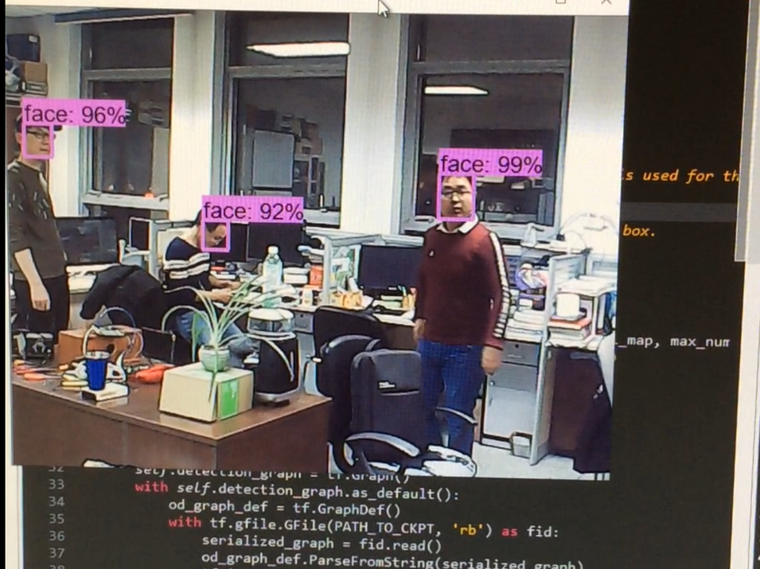

# tensorflow face deteector
The face detection model data from wider-face，base on Faster R-CNN

## Model performance
Speed: based on nvidia GTX1070ti 12G memory per second to reach about 60fps

## Instructions for use:
Baidu cloud download already trained frozen_inference_graph.pb model (about 180 m), the link: https://pan.baidu.com/s/1JyT8wbH4cjzE5LBSqsMdZQ extract code:3dt5, replacement model files directoryfrozen_inference_graph.pb   
run usb_cam_face.py file
## Environment description:
Tensorflow-gpu ==1.10.0 opencv==3.4.2 (python). Since this model is based on the training of tensorflow detection API, the correct operation cannot be guaranteed if the tensorflow detection API is not configured
## The running effect is as follows:

